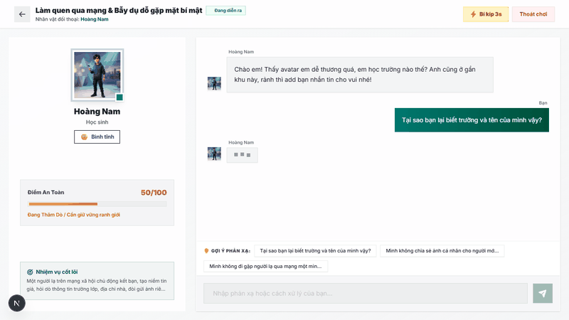
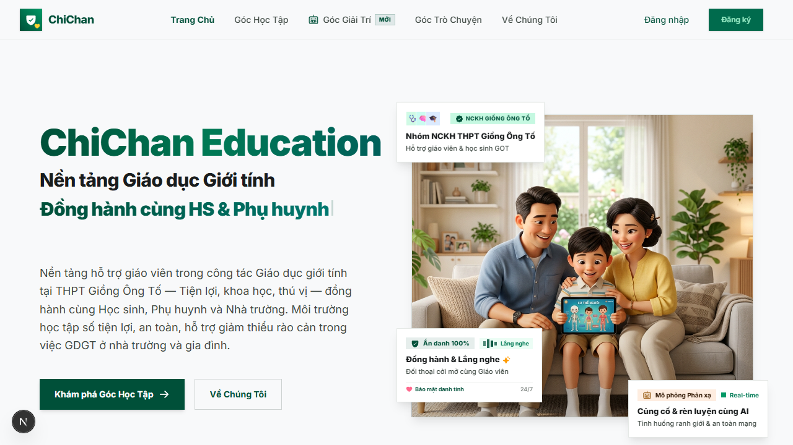
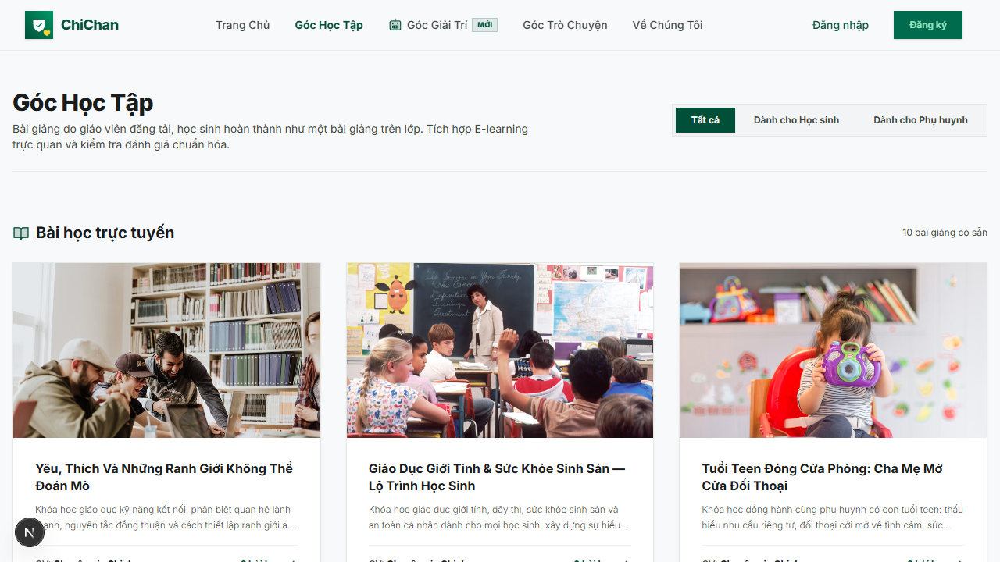
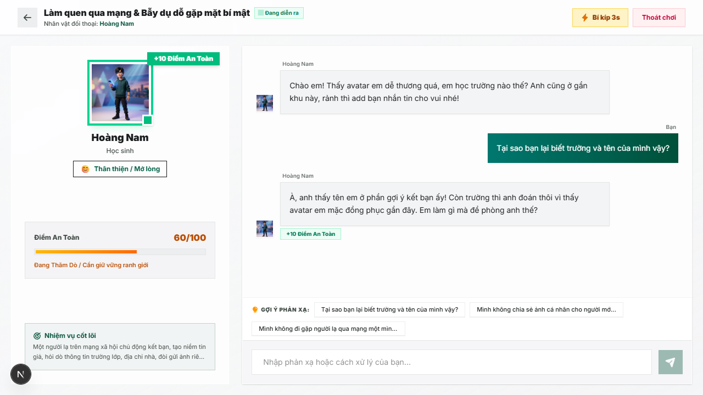
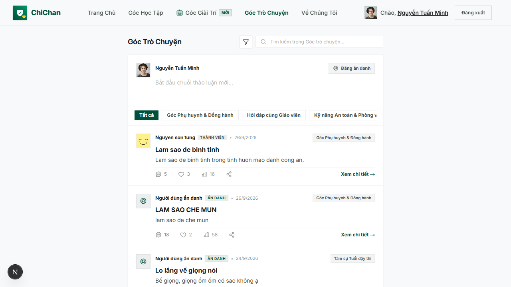
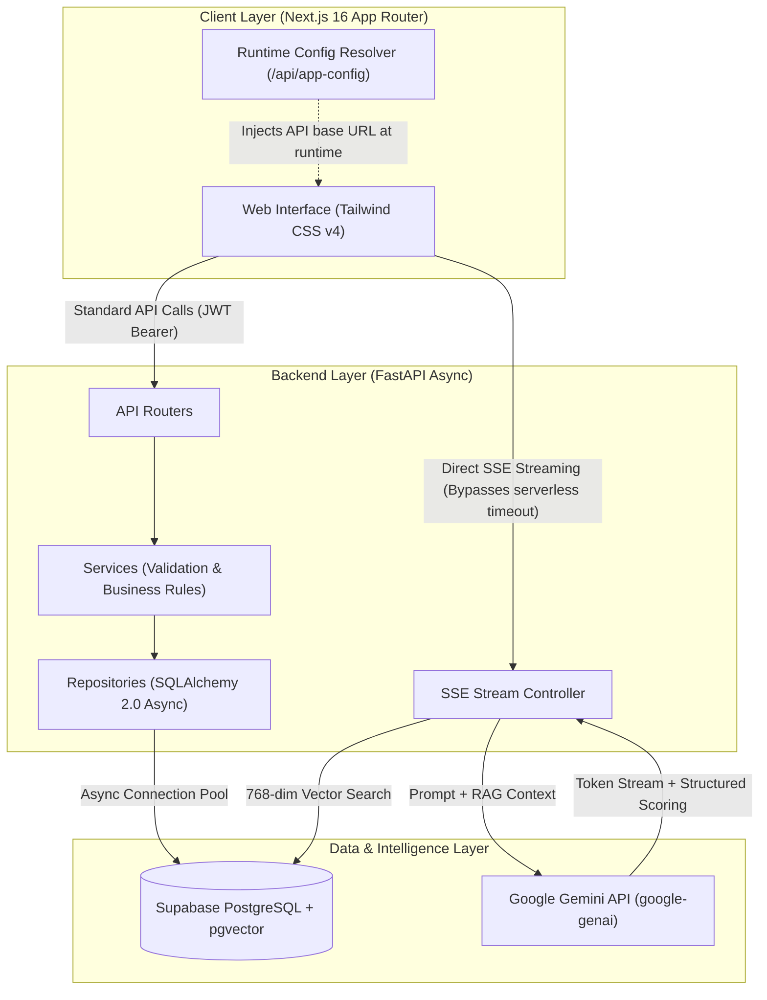

# ChiChan Platform

[](LICENSE)
[](https://fastapi.tiangolo.com)
[](https://nextjs.org)
[](https://www.python.org/)
[](https://supabase.com)
[](https://ai.google.dev/)

> *Sex education shouldn't be awkward — ask directly, learn properly, and practice before facing real-world situations.*

ChiChan is an open-source e-learning and behavioral simulation platform for sex education and digital self-defense, built within a scientific research initiative at **Giong Ong To High School**.

---

## Origin: A Question We Were Afraid to Ask

Adolescents have thousands of questions about their changing bodies, relationships, and the sensitive topics that school curricula often avoid. Turning to search engines returns a flood of search results — most of it age-inappropriate, and much of it flat-out misleading. Asking parents feels embarrassing. Staying silent, however, is dangerous.

We set out to create a genuine **safe haven** to:

- **Learn properly**: Structured, bite-sized modular video lessons paired with interactive quizzes and automated certificates of completion.
- **Ask without fear**: An anonymous community forum with human moderation queues and profanity filtering, ensuring teenagers can ask honest questions without fear of judgment, exposure, or harassment.
- **Practice before facing reality**: The heart and soul of the platform — an interactive AI roleplay simulator. Users step into realistic chat scenarios: navigating unsolicited messages from online strangers, de-escalating cyber extortion and sextortion threats, or consulting a virtual adolescent physician. Make the right choices and your safety score climbs; make a misstep, and the character reacts realistically. It feels like an RPG, but every decision trains real-world, life-saving reflexes.

Under the hood, **Google Gemini** powers the experience with token-by-token streaming, structured emotion tagging, and real-time decision scoring. Crucially, all medical guidance is grounded through a **pgvector (RAG)** knowledge base to ensure advice is strictly factual, never hallucinated.

---

## Demo Preview

| [Live Web Application](https://chichan.vercel.app) | [Interactive API Documentation](http://127.0.0.1:8000/docs) | [HD Video Walkthrough](docs/assets/videos/chichan_demo_walkthrough.webm) |
|---|---|---|

### AI Roleplay Simulation in Action

<div align="center">
  
  <p><em>Live token-by-token SSE streaming, structured emotion changes, and dynamic safety score tracking.</em></p>
</div>

### Platform Interface Gallery

| Modern Landing Page | E-Learning Course Catalog |
|:---:|:---:|
|  |  |
| **Interactive AI Roleplay Room** | **Anonymous Moderated Community Forum** |
|  |  |

---

## System Architecture



---

## Battle-Tested Engineering Insights

This codebase reflects solutions to non-trivial production challenges encountered during development:

1. **Decoupling Build Time from Runtime Config (`NEXT_PUBLIC_*` Pitfall)**  
   *Problem:* Next.js with Turbopack inlines `NEXT_PUBLIC_*` variables during compilation across both client bundles and server chunks. Building the container once and deploying across staging/production resulted in frozen, unchangeable API URLs.  
   *Resolution:* Implemented a runtime configuration endpoint (`/api/app-config`) consumed dynamically by the client, guarded by pre-commit build checks.

2. **Decoupling Long-Lived LLM Streams from Database Sessions**  
   *Problem:* Chat completions stream via Server-Sent Events (SSE). Injecting a standard request-scoped database session held PostgreSQL connections active for 1–2 minutes while tokens were generated, exhausting the connection pool.  
   *Resolution:* Refactored to pass an `AsyncSession` factory, acquiring and releasing database connections only during transient I/O phases (e.g., initial vector retrieval and final transcript persistence).

3. **Eliminating Unbounded Feed Queries & N+1 Bottlenecks**  
   *Problem:* Forum feeds suffered from unindexed full-table scans and per-post comment count queries.  
   *Resolution:* Migrated to `GROUP BY` aggregates with keyset/cursor pagination. Implemented backward-compatible response shims to prevent breaking legacy client builds.

4. **Async Event-Loop Offloading for CPU-Bound Operations**  
   *Problem:* Synchronous password hashing via `bcrypt` stalled FastAPI's single asyncio event loop under concurrent registration spikes.  
   *Resolution:* Routed CPU-heavy cryptographic operations to worker thread pools via `asyncio.to_thread`.

5. **Mitigating Schema Drift Without Heavy ORM Overhead**  
   *Problem:* Production schema alterations created disparities with version-controlled SQL files.  
   *Resolution:* Built an idempotent migration runner pattern (`backfill` → `guard` → `constrain`) validated through automated introspection checks comparing SQLAlchemy metadata against live instances.

6. **Direct SSE Routing for Serverless Deployments**  
   *Problem:* Edge/Serverless function execution timeouts on frontend hosts severed long-running AI roleplay conversations.  
   *Resolution:* SSE streams connect directly from browser clients to the backend host (Render), bypassing frontend proxy timeouts while maintaining JWT authorization.

---

## Tech Stack

| Domain | Technology |
|---|---|
| **Backend** | FastAPI, SQLAlchemy 2.0 (asyncpg), Pydantic v2, Python-Jose |
| **Frontend** | Next.js 16 (App Router, Turbopack), Tailwind CSS v4, Phosphor Icons, Plyr |
| **Database & Vector** | Supabase PostgreSQL, `pgvector` (768-dimensional embeddings) |
| **AI & Inference** | Google Gemini (`google-genai`), Structured Output, SSE Streaming |
| **Infrastructure** | Render (API Engine), Vercel (Static/SSR Edge), Supabase Cloud (Data) |

---

## Monorepo Layout

```
chichan/
├── backend/
│   ├── api/             # Route handlers & endpoints
│   ├── core/            # Database engine, configuration, security
│   ├── models/          # SQLAlchemy ORM definitions
│   ├── repositories/    # Encapsulated database operations
│   ├── schemas/         # Pydantic validation schemas
│   └── services/        # Domain logic, AI orchestration, profanity filtering
├── frontend/
│   ├── src/app/         # App router pages, route groups, layouts
│   ├── src/components/  # Modular UI elements, video players, chat widgets
│   ├── src/context/     # State providers (AuthContext, ToastContext)
│   └── src/lib/         # Runtime API client, configuration loaders
├── database/            # DDL definitions (schema.sql, seed.sql, migrations)
├── docs/                # Feature specifications, audits, and deployment runbooks
└── scratch/             # Ignored local debug scripts
```

---

## Local Development Setup

### Prerequisites

- Python 3.11 or later
- Node.js 20 LTS or later
- PostgreSQL instance with `pgvector` enabled (or Supabase project)

### 1. Backend Service

```bash
cd backend

# Create and activate virtual environment
python -m venv venv
# Windows (PowerShell):
.\venv\Scripts\Activate.ps1
# Unix/macOS:
source venv/bin/activate

# Install dependencies
pip install -r requirements.txt

# Configure environment
cp .env.example .env
# Update DATABASE_URL, SECRET_KEY, and AI_API_KEY in .env

# Start application
python -m uvicorn main:app --reload
```
API documentation is available locally at `http://127.0.0.1:8000/docs`.

### 2. Frontend Application

```bash
cd frontend

# Install package dependencies
npm install

# Start development server
npm run dev
```
The client interface is accessible at `http://localhost:3000`.

---

## Documentation Index

- [Project Overview & Specification](docs/overview.md)
- [Maintainability & Scaling Post-Mortem](docs/refactor_maintainability_scale.md)
- [Runtime Environment Independence Guide](docs/refactor_env_independent_build.md)
- [Backend Deployment Runbook (Render)](docs/deployment/render.md)
- [Frontend Deployment Runbook (Vercel)](docs/deployment/vercel.md)
- [Database Schema Reference](database/schema.sql)

---

## Contribution Guidelines

- **Commit Format**: All commits must adhere to [Conventional Commits](https://www.conventionalcommits.org/) (`feat:`, `fix:`, `chore:`, `refactor:`).
- **Branch Strategy**: Branch from and PR into `dev`. Production releases are cut by merging `dev` into `main`.
- **Localization Boundary**: Codebase artifacts (code, documentation, PRs, comments) remain in English. User-facing strings, curriculum materials, and AI personas are localized in Vietnamese.
- **Security**: Never commit `.env` files or hardcode credentials.

---

## License

This project is licensed under the [MIT License](LICENSE).

---

<div align="center">

**Giong Ong To High School — Scientific Research Initiative**  
*Knowledge is Empowerment.*

</div>
